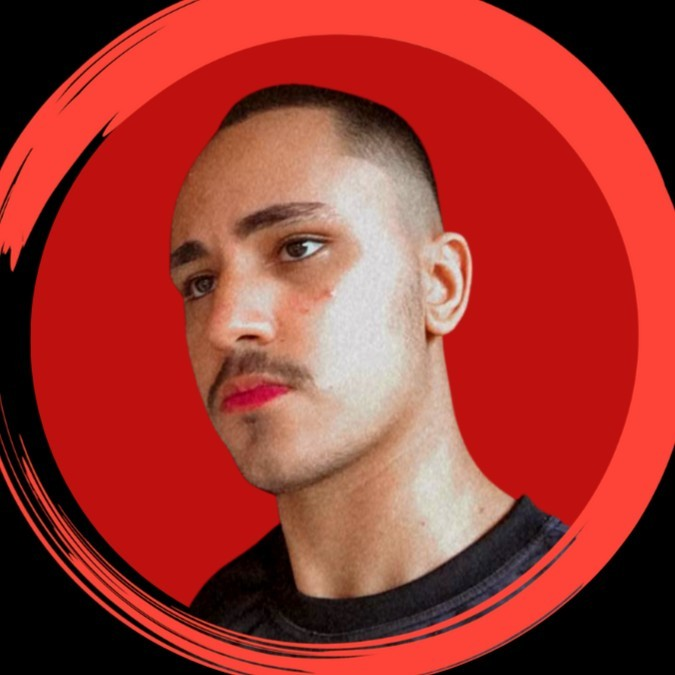
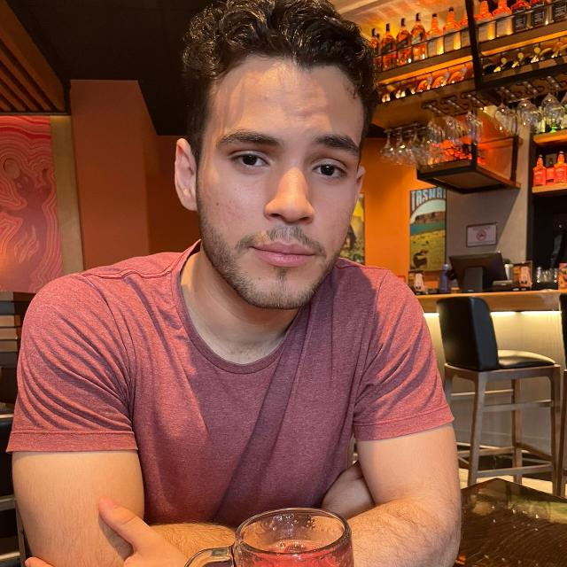

# System Pharmacy [Part 2]

# Project-GroupSearchGPT

Project started and completed in 2023, prepared in less than 1 week. <strong> To view the project go to: </strong> https://pereira3r.github.io/LandingPage-GroupSearchGPT/

## Overview
The project is nothing more than a landing page that was requested by a research and extension group at the Federal University of Mato Grosso. The idea was basically to do something to show the focus of the research group, in addition to presenting its members and what they do.

## Technologies Used

The technologies used to develop the project are very simple.

 
  
  
  
  

## Usage

To use the project, simply use the VsCode live server in "index.html" we didn't do the backend.

 

## Contact
<strong> Project Developer Members: </strong> We are both Computer Science students at the Federal University of Mato Grosso

| Anthony Ricardo Rodrigues Rezende | Letízia Manuella Serqueira Eugênio | Vinícius Padilha Vieira|
| --- | --- | --- |
|  |  |  |

- **Email:** anthony_rodriguespereira@outlook.com
- **LinkedIn:** [Anthony's LinkedIn](https://www.linkedin.com/in/anthony-ricardo-rodrigues-rezende-486917227/)

- **Email:** letizia.ccufmt@gmail.com
- **LinkedIn:** [Letizia's LinkedIn](https://www.linkedin.com/in/let%C3%ADzia-manuella-computerscience/)

- **Email:** viniciuspadilhavieira@hotmail.com
- **LinkedIn:** [Vinícius's LinkedIn](https://www.linkedin.com/in/vin%C3%ADcius-vieira-2918a1236?trk=contact-info)

## Acknowledgments
Useful resources that we would like to give credit for.

- CSS Web3School [https://www.w3schools.com/css/default.asp](https://www.w3schools.com/css/default.asp)
- JS Web3School [https://www.w3schools.com/js/default.asp](https://www.w3schools.com/js/default.asp)
- Bootstrap [https://getbootstrap.com/](https://getbootstrap.com/)

##

